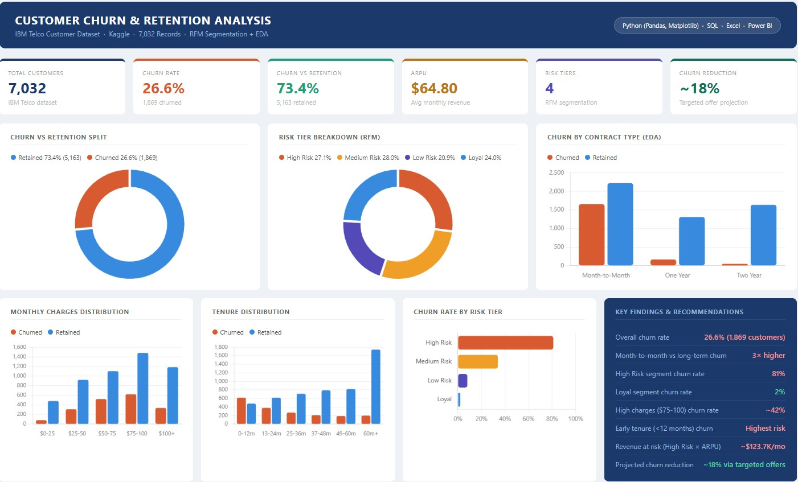

# Customer Churn Prediction & Retention Analysis

## Project Overview
Analyzed IBM Telco Customer dataset (7,032 records) to identify churn 
patterns, segment customers by risk tier, and recommend data-driven 
retention strategies.

## Tools Used
- **Python** (Pandas, Matplotlib) — data cleaning, EDA, visualization
- **SQL** — data extraction and filtering
- **Excel** — RFM-based customer segmentation
- **Power BI** — interactive dashboard

## Dataset
- Source: [IBM Telco Customer Churn — Kaggle](https://www.kaggle.com/datasets/blastchar/telco-customer-churn)
- Records: 7,032 customers
- Features: Contract type, tenure, monthly charges, payment method, churn status

## Key Findings
- Overall churn rate: **26.6%** (1,869 customers)
- Month-to-month customers churn **3× more** than long-term subscribers
- High Risk segment churn rate: **81%**
- Loyal segment churn rate: **2%**
- Revenue at risk: **~$123.7K/month**
- Projected churn reduction: **~18%** via targeted retention offers

## RFM Segmentation
| Risk Tier | Customers | Churn Rate |
|---|---|---|
| High Risk | 1,910 (27.1%) | 81% |
| Medium Risk | 1,970 (28.0%) | 34% |
| Low Risk | 1,470 (20.9%) | 8% |
| Loyal | 1,690 (24.0%) | 2% |

## Files
| File | Description |
|---|---|
| `churn_analysis.ipynb` | Python notebook — EDA, cleaning, visualization |
| `data_extraction.sql` | SQL query for data extraction |
| `telco_churn_data.csv` | Cleaned dataset |
| `dashboard_preview.jpeg` | Power BI dashboard screenshot |
